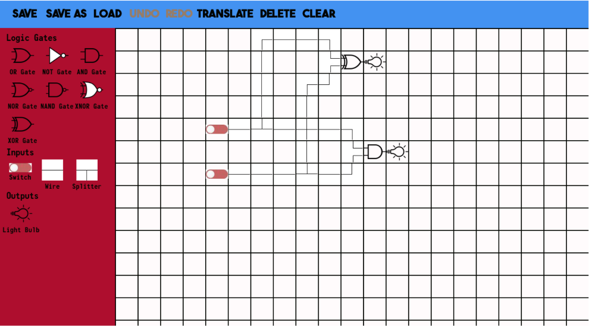

<h1>Logic Gate Simulator</h1>

This project was written for my A-level Computer Science NEA to the AQA exam board specification between 2023 and 2024.

## Overview

A graphical logic gate simulator built with Pygame. The simulator allows creating digital circuits on a grid using gates (AND, OR, NOT, XOR, XNOR, NAND, NOR), switches, lights, clocks and D flip-flops. Circuits can be saved/loaded and truth tables can be generated for switch-to-light mappings.

## Documentation

Comprehensive documentation for this project can be found in the Logic Gate Simulator Project Report.pdf

## Features

- Grid-based circuit editor with drag-and-place workflow
- Common logic gates and wiring primitives (straight, corners, splitters, crosses)
- Switches, light bulbs, clocks, and edge-triggered D flip-flops
- Save / Load projects (pickle format)
- Auto-save option
- Built-in tutorial and pre-made adder circuits (half & full)
- Truth table generation for detected switches and outputs

## Quick start

Prerequisites:
- Python 3.8+
- pygame

Install dependencies:
- pip install pygame

Run:
- python "Logic Gate Simulator.py"

Notes:
- The project expects an images/ folder with UI and gate assets.

## Usage / Controls

- Main Menu → New File / Load File / Tutorial / Adders
- Select an item from the left toolbar (gate, switch, wire, clock, bulb) and click a grid square to place it.
- Click placed switches to toggle ON/OFF.
- Save uses pickle files; use "Save As" to create a new file name.
- Keyboard shortcuts:
  - Ctrl+S : Save
  - Ctrl+L : Load
  - Ctrl+Z : Undo
  - Ctrl+Y : Redo

## Truth table generation

- Use the "Truth Table" button in the logic editor. The tool detects all switches and lights in the circuit and computes outputs for each combination of switch inputs.
- If a circuit uses memory elements (flip-flops or clocks), results may depend on timing; verify expected behavior in the running simulator.

## License & Acknowledgements

- Licensed under Apache 2.0 
- Acknowledgements: Check Included Google Doc for full list of acknowledgments

## Contact

- For questions about this project, contact Harry Taylor (ht555@exeter.ac.uk).
